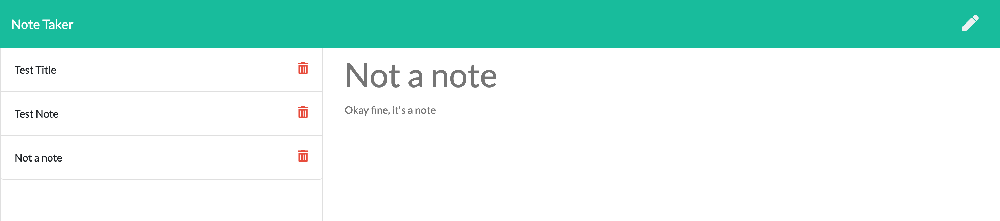

  # Note Taker  
  ##    
  ## Screenshot  
  
  ## Description  
  A web app to write, save, view, and delete notes using an Express.js server.  
  ## Table of Contents  
  * [Installation](#installation)  
  * [Usage](#usage)  
  * [License](#license)  
  * [Contributing](#contributing)  
  * [Tests](#tests)  
  * [Questions](#questions)  
  ## Installation  
  None needed. Just [visit the website](https://thawing-shore-21514.herokuapp.com/)!  
  ## Usage  
  Click on Get Started to view saved notes. A note can be saved once it has a title and note text. Click the save icon to save your finished note, click on an existing note's title to view that note, click the pencil icon to start a new note, and click the trash icon to delete a note.  
  ## License  
  This project is licensed under the MIT license.  
  ## Contributing  
  Please feel free to reach out to me at the contact information below if you would like to contribute or have any suggestions for future functionality.  
  ## Tests  
  N/A  
  ## Questions  
  If you have any questions regarding this project, please contact me at:  
  GitHub: [mjgross82](https://github.com/mjgross82)  
  Email: [mjgross@pm.me](mailto:mjgross@pm.me)
  